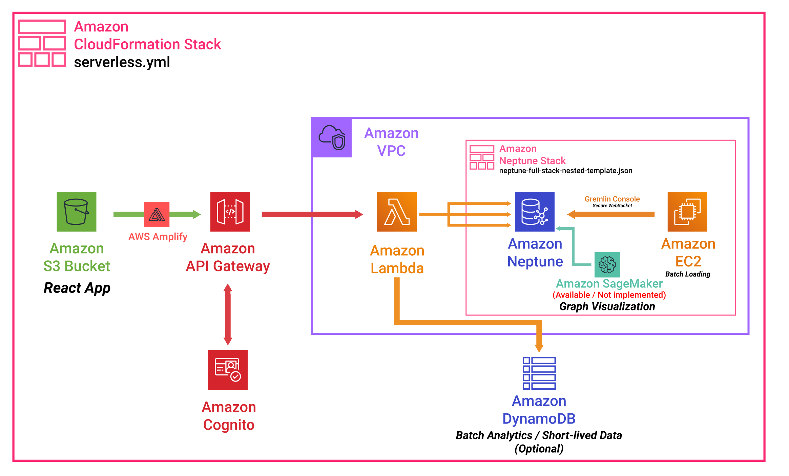
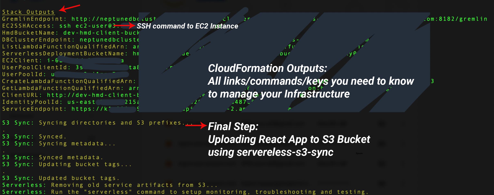
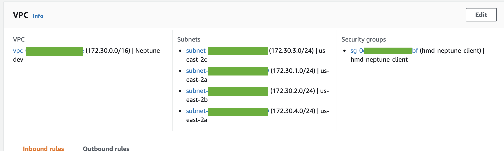

# Fullstack Serverless Recommendations Application powered by AWS Neptune

## Requirments

- AWS Account (Billing Enabled)
- NodeJS
- NPM

## Architecture

Components:

- Amazon CloudFormation (For defining the Infrastructure as Code)
- Amazon API Gateway (For Exposing HTTP endpoints)
- Amazon Neptune (Persistance layer)
- Amazon Cognito (Managing Authentication)
- Amazon EC2 (Access Neptune programmatically / Bulk Ingestion)
- Amazon S3 (1 bucket to host Lamda function + 1 bucket host client app)
- Amazon Amplify (Multi-platform libraries to connect to API Gateway endpoints from client code)
- Amazon DynamoDB (Optional: to store short-lived data / analytics. Installed but not really demonstrated in this repo)
- Amazon SageMaker ([Option Available here](resources/neptune-cluster.yml) / Not Installed for now)

This project is based on [Serverless Stack](http://serverless-stack.com) along with the [AWS official CloudFormation Neptune template](https://docs.aws.amazon.com/neptune/latest/userguide/get-started-create-cluster.html).

#### CloudFormation Templates

- Main Stack Template: [serverless.yml](serverless.yml)
  - API Gateway Errors [resources/api-gateway-errors.yml](resources/api-gateway-errors.yml)
  - DynamoDB [resources/dynamodb-table.yml](resources/dynamodb-table.yml)
  - S3 to serve UI [resources/s3-ui-bucket.yml](resources/s3-ui-bucket.yml)
  - Neptune Stack [resources/neptune-cluster.yml](resources/neptune-cluster.yml)
  - Cognito User Pool [resources/cognito-user-pool.yml](resources/cognito-user-pool.yml)
  - Cognito Identity Pool [resources/cognito-identity-pool.yml](resources/cognito-identity-pool.yml)

## Deployment 

#### Steps

1. AWS
    - (A) [Setup AWS CLI](https://docs.aws.amazon.com/polly/latest/dg/setup-aws-cli.html)
    - (B) [Create an EC2 Key Pair](https://docs.aws.amazon.com/AWSEC2/latest/UserGuide/ec2-key-pairs.html#prepare-key-pair) and download it to your local repo root

2. Build React App
    - `npm i`
    - `cd app && react-scripts build`
3. Deploy to AWS using Serverless
    - From repo root: `npm i -g serverless`
    - `npm i `
    - `serverless deploy -v` (Takes ~20 minutes)
    - Wait till you see this output
    - 

4. Configurations (To be improved):
    - (A) Rename `app/config_TEMPLATE.js` to `config.js` (git Ignored) and populate it with the correct keys from previous step. After this step you need to reupload the assets to the UI S3 bucket by either repeating step 3 or doing a Partial Deploy (Check below).
    - (B) Open all js files in `/functions` and change gremlin endpoint to endpoints from previous step
5. Double check Lambda Functions VPC (To be improved):
    - Log into [AWS Lambda Dashboard](console.aws.amazon.com/lambda/home) and make sure all Lambda Functions are connected to the Neptune Stack VPC, subnets and same Security Group.
    - 
6. TEST!! 🎉🎉
    - Open the Client URL from serverless output
    - Create an account with your email (authentication managed by AWS Cognito)
    - Log in and start using the simple node management app.
    - Available API Gateway endpoints are: (List/Get/Create). Each Endpoint maps to one Lambda Function inside [/functions](functions/) directory

#### Other useful steps

- Partial deploy: UI only 
    - From root `aws s3 sync app/build s3://S3_BUCKET` (after react building)
- Partial deploy: Lambda Only
    - `servereles deploy -f FUNCTIONNAME` - rebuild lambda function and upload zip to S3

## How does it work? How does it access the Graph from UI?

1. You can access the graph by querying the Neptune Cluster from Lambda Function written in **[any of the supported languages/drivers](https://docs.aws.amazon.com/neptune/latest/userguide/access-graph-gremlin.html)**.
2. You write the Lambda function in **[any chosen language](https://www.serverless.com/framework/docs/providers/aws/guide/intro/)** and define it in the [serverless.yml](serverless.yml) file.
3. Deploy and the API endpoint will be exposed automatically :)
4. Call the endpoint from **any client app** using [AWS Amplify](https://aws.amazon.com/amplify/).

## Connecting to Neptune Gremlin Console from EC2

 - Use the SSH command from the serverless deployment output to access EC2
 - Test using the commands 8-12 in [this article](https://docs.aws.amazon.com/neptune/latest/userguide/access-graph-gremlin.html). **(Gremlin Console is already installed on the instance. Start from step 8)**

## Missing Features

- Bulk Ingestion from CSV files
    - Ref: [Using the Amazon Neptune Bulk Loader to Ingest Data](https://docs.aws.amazon.com/neptune/latest/userguide/bulk-load.html)
- SageMaker Notebooks Graph Visualization
    - Ref: [Analyze Amazon Neptune Graphs using Amazon SageMaker Jupyter Notebooks](https://aws.amazon.com/blogs/database/analyze-amazon-neptune-graphs-using-amazon-sagemaker-jupyter-notebooks/)

## Issues/Improvements

- Remove step 4 (A) "Setup React app AWS config" by setting environment variables
- Remove step 4 (B) by pulling Gremlin endpoint/port from environment variables in Lambda functions
- Remove step 5 by assigning Lambda Functions to VPC in deployment stage using CloudFormation YAML
